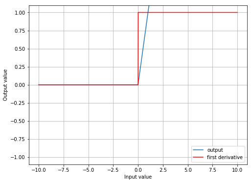
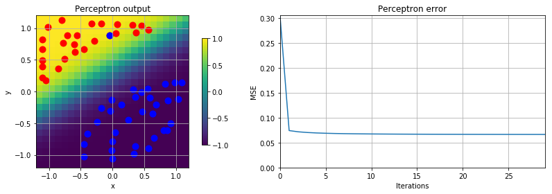
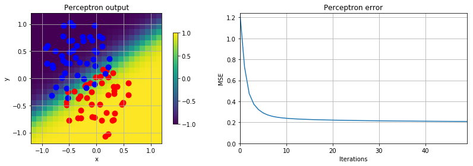
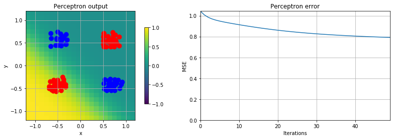
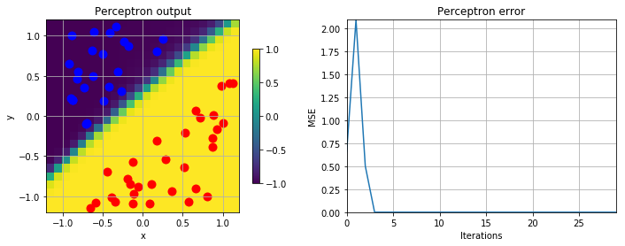
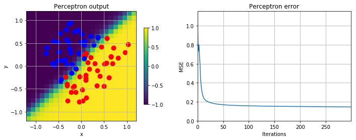
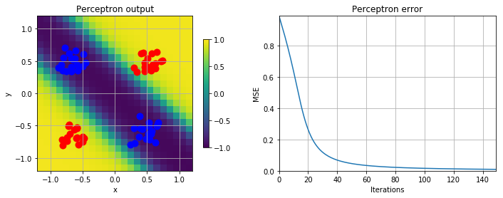
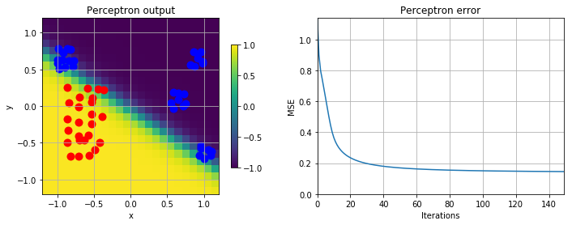

# PW09
**Auteurs : Pedro Costa, Louis Delabays, Jonathan Guerne**

## ReLu implementation


```python
def ReLu(neta):
    
    output = neta.copy()
    output[output < 0] = 0
    
    d_output = neta.copy()
    d_output[d_output >= 0] = 1
    d_output[d_output < 0] = 0
    
    return (output, d_output)
```



Weight will impact the shape of the function on both axis. The higher the weight, the bigger the splot of the derivate (can be a positive or a negative slope depending on the weigth sign). 

## Delta rules 

### well defined boundaries 

Data separated by well defined boundaries can be classified quickly (high convergence speed) and may even use a pretty high learning rate. The error graph will also have little to no ossillations as there might be only one minium (no local minimum problem).



### overlapping

Overlapping data will still be separable but the classification will have an higher error. It will take slighlty longer to converge and it might be useful to reduce the learning rate (even if it means even more time until convergence) to avoid ossilliations.



### non separable 

Non-separable data will generate a high error as the algorithme is not capable of properly classify the data using only one line. It will try to minimize the error as shown in the illustration, in our case all the blue data appear in one side. But this is only a local minia and not a global minima as it allow to classify properly one class (blue) but not all classes.



## Backpropagation

### separable data

- may use a big learning rate
- will ocnverge quickly
- more ossillation than a one neuron model



### overlapping data

- need a smaller learning rate
- will need more time to converge
- ossillation in error signal will disapear with a lower learning rate



### non-separable data

- multiple neurons are able to separate data properly
- not a local minimum anymore



### blob

- will trace a line to separate the data as well as possible



## Back propagation momentum

```python
    def fit(self, data_train, data_test=None, learning_rate=0.1, momentum=0.9, epochs=100):
        .
        .
        .
        
            delta_weights_ = []
            for i_ in range(len(self.weights)):
                delta_weights_.append(0)

                .
                .
                .

                delta_weights_[i] = -learning_rate * layer.T.dot(delta) + momentum * delta_weights_[i]
                self.weights[i] += delta_weights_[i]
```


## Model selection

MSE training:  0.127171037722032
MSE test:  0.12917217752873786
Confusion matrix:
[[98.  2.]
 [ 2. 98.]]
